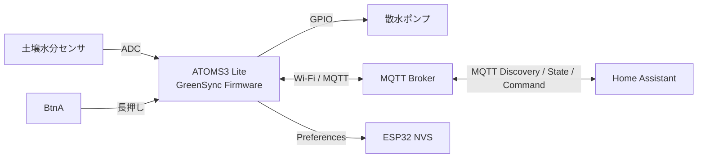
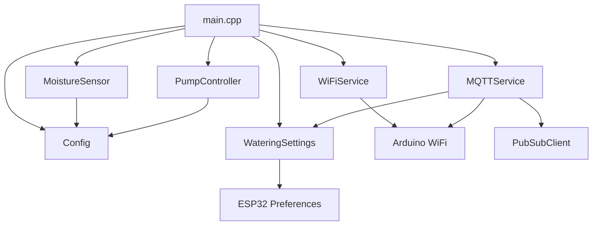
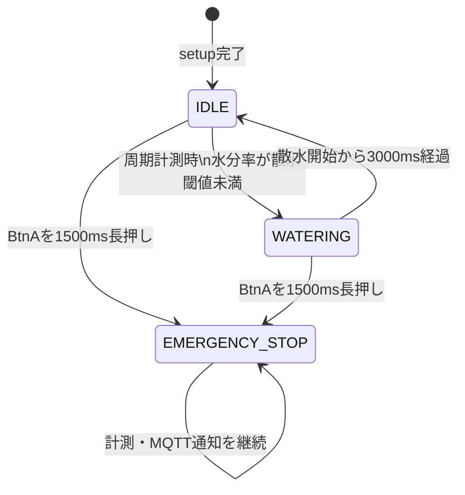
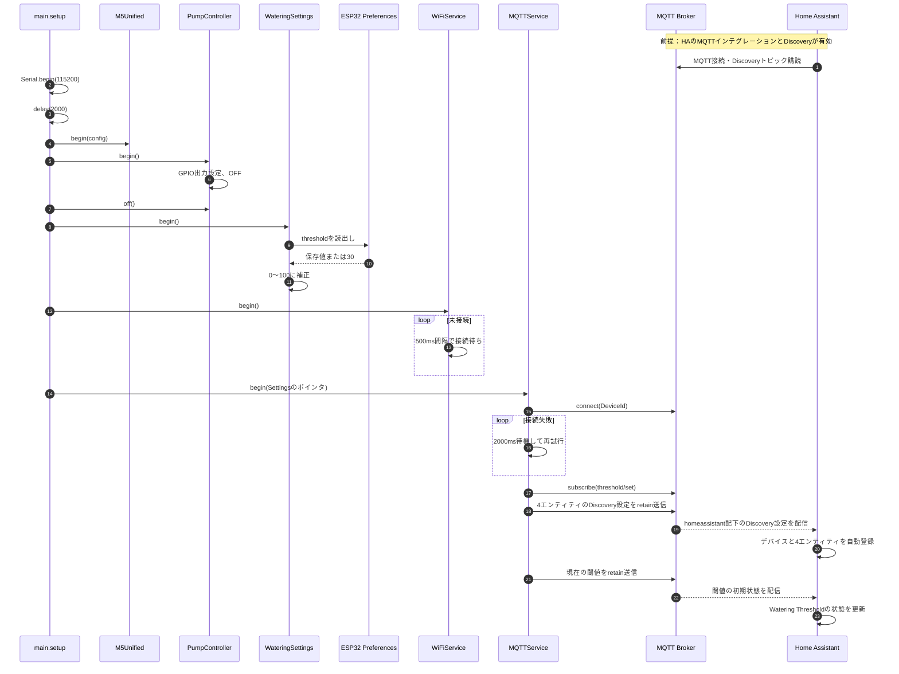
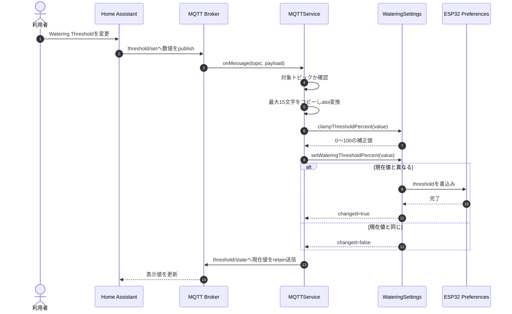

# GreenSync PoC-001 内部設計書

## 1. 文書情報

| 項目 | 内容 |
|---|---|
| 対象システム | GreenSync PoC-001 Unit Watering |
| 対象実装 | `firmware/atom-s3-lite` |
| 対象デバイス | M5Stack ATOMS3 Lite + Unit Watering |
| ファームウェア | GreenSync Firmware v0.2.0 MQTT |
| 作成日 | 2026-07-19 |

## 2. 目的

本書は、土壌水分の計測、自動散水、緊急停止、Home Assistant 連携を行う GreenSync ファームウェアの内部構造および処理方式を定義する。

ESPHome 版の設定は検証用の別実装であるため、本書では PlatformIO でビルドする `firmware/atom-s3-lite` を対象とする。

## 3. システム概要

ファームウェアは土壌水分センサを10秒周期で読み取り、測定値が設定された散水閾値を下回るとポンプを3秒間駆動する。測定値、ポンプ状態、Wi-Fi受信強度は MQTT を通じて Home Assistant に通知する。

散水閾値は Home Assistant から変更でき、ESP32 の不揮発領域に保存する。デバイスのボタンを1.5秒長押しすると緊急停止状態へ遷移し、ポンプを強制停止する。



## 4. 動作環境

| 項目 | 設定 |
|---|---|
| フレームワーク | Arduino |
| ビルド環境 | PlatformIO |
| ボード | `m5stack-atoms3` |
| シリアル速度 | 115200 bps |
| M5Unified | `^0.2.17` |
| PubSubClient | `^2.8` |
| MQTT最大パケット長 | 1024 bytes |

Wi-Fi SSID、Wi-Fiパスワード、MQTT接続先は `include/Secrets.h` のビルド時秘密情報から取得する。

## 5. モジュール構成

| モジュール | クラス・要素 | 責務 |
|---|---|---|
| メイン制御 | `main.cpp` | 初期化、周期制御、状態遷移、モジュール間連携 |
| 設定値 | `Config` | GPIO、校正値、周期、散水時間などのコンパイル時定数 |
| 水分計測 | `MoistureSensor` | ADC値の取得と水分率への変換 |
| ポンプ制御 | `PumpController` | ポンプGPIOの初期化、ON/OFF |
| 散水設定 | `WateringSettings` | 散水閾値の保持、範囲補正、NVSへの永続化 |
| Wi-Fi通信 | `WiFiService` | Stationモードでの接続とRSSI取得 |
| MQTT通信 | `MQTTService` | Broker接続、Discovery、状態送信、閾値コマンド受信 |

### 5.1 依存関係



## 6. 内部データ設計

### 6.1 コンパイル時設定

| 定数 | 値 | 用途 |
|---|---:|---|
| `MoisturePin` | 1 | 土壌水分センサ入力GPIO |
| `PumpPin` | 2 | ポンプ出力GPIO |
| `DryRaw` | 2150 | 水分率0%に対応するADC校正値 |
| `WetRaw` | 1770 | 水分率100%に対応するADC校正値 |
| `WateringThresholdPercent` | 30 | 散水閾値の初期設計値 |
| `WateringDurationMs` | 3000 ms | 1回の散水時間 |
| `TelemetryIntervalMs` | 10000 ms | 計測・通知周期 |
| `EmergencyStopHoldMs` | 1500 ms | 緊急停止を検出する長押し時間 |

注: 永続設定のデフォルト値30%は `WateringSettings.cpp` にも定義されている。現在 `Config::WateringThresholdPercent` は実行時の初期化処理から直接参照されていない。

### 6.2 実行時データ

| 変数 | 型 | 内容 |
|---|---|---|
| `controllerState` | `ControllerState` | 現在の制御状態 |
| `lastTelemetryAtMs` | `unsigned long` | 最終周期処理開始時刻 |
| `wateringStartedAtMs` | `unsigned long` | 散水開始時刻 |
| `lastRaw` | `int` | 直近のADC値 |
| `lastPercent` | `int` | 直近の水分率 |
| `hasSensorSample` | `bool` | 有効な測定値を保持しているか |

時刻差分は `unsigned long` の減算で求めるため、`millis()` のオーバーフローをまたいでも周期判定できる。

### 6.3 永続データ

| 項目 | 値 |
|---|---|
| Preferences namespace | `greensync` |
| キー | `threshold` |
| データ型 | `int` |
| 許容範囲 | 0～100 |
| デフォルト | 30 |

## 7. 状態設計

### 7.1 状態一覧

| 状態 | 説明 | ポンプ |
|---|---|---|
| `IDLE` | 計測および散水判定を行う通常待機状態 | OFF |
| `WATERING` | 設定時間が経過するまで散水する状態 | ON |
| `EMERGENCY_STOP` | 緊急停止後、自動散水を禁止する状態 | OFF |

### 7.2 状態遷移



`EMERGENCY_STOP` からの解除遷移は実装されていない。解除にはデバイス再起動が必要である。

## 8. 内部処理設計

### 8.1 起動処理

1. シリアル通信を開始し、2秒待機する。
2. M5Unified を初期化する。
3. ポンプGPIOを出力に設定し、ポンプをOFFにする。
4. NVSから散水閾値を読み込む。
5. Wi-Fiへ接続する。
6. MQTT Brokerへ接続する。
7. 閾値設定トピックを購読する。
8. Home Assistant Discovery設定をMQTT Brokerへ送信する。
9. BrokerがDiscovery設定をHome Assistantへ配信し、Home Assistantがデバイスと各エンティティを自動登録する。
10. 現在の散水閾値を送信し、登録された閾値エンティティの状態を初期化する。

自動登録には、Home Assistant側でMQTTインテグレーションが構成済みであり、Discoveryが有効になっていることを前提とする。Home Assistantとデバイスは、同じMQTT Brokerへ接続する。



### 8.2 メインループ

メインループは次の優先順で処理する。

1. ボタン状態とMQTT受信処理を更新する。
2. BtnA長押しを検出した場合、緊急停止する。
3. 散水時間が満了した場合、散水を停止する。
4. 初回または10秒周期で水分を計測し、必要に応じて散水を開始する。
5. 状態に変化があった場合、または周期計測を行った場合、MQTT状態を送信する。

### 8.3 周期計測・自動散水シーケンス

```mermaid
sequenceDiagram
    autonumber
    participant Loop as main.loop
    participant Sensor as MoistureSensor
    participant Settings as WateringSettings
    participant Pump as PumpController
    participant WiFi as WiFiService
    participant MQTT as MQTTService
    participant Broker as MQTT Broker
    participant HA as Home Assistant

    Loop->>Loop: 初回または前回計測から10000ms経過
    Loop->>Sensor: readRaw()
    Sensor-->>Loop: ADC値
    Loop->>Sensor: readPercent()
    Sensor->>Sensor: ADC再読出し
    Sensor->>Sensor: map(DryRaw, WetRaw, 0, 100)
    Sensor->>Sensor: 0～100に制限
    Sensor-->>Loop: 水分率
    Loop->>Settings: wateringThresholdPercent()
    Settings-->>Loop: 散水閾値
    alt 状態がIDLE かつ 水分率が散水閾値未満
        Loop->>Pump: on()
        Loop->>Loop: 状態=WATERING、開始時刻を保存
    else その他
        Loop->>Loop: 現在状態を維持
    end
    Loop->>WiFi: rssi()
    WiFi-->>Loop: RSSI
    Loop->>MQTT: publishState(raw, moisture, rssi, watering)
    MQTT->>Broker: 状態JSONをretain送信
    Loop->>MQTT: publishSettings()
    MQTT->>Broker: 閾値JSONをretain送信
    Broker-->>HA: 状態・閾値を配信
```

`readMoistureSample()` は `readRaw()` と `readPercent()` を順に呼ぶ。`readPercent()` 内でもADCを読み取るため、通知する `raw` と水分率の変換元は厳密には別サンプルである。

### 8.4 散水完了シーケンス

```mermaid
sequenceDiagram
    autonumber
    participant Loop as main.loop
    participant Pump as PumpController
    participant MQTT as MQTTService
    participant Broker as MQTT Broker

    Loop->>Loop: 状態がWATERINGか確認
    Loop->>Loop: 散水開始から3000ms以上経過
    Loop->>Pump: off()
    Loop->>Loop: 状態=IDLE
    Loop->>MQTT: publishState(..., watered=false)
    MQTT->>Broker: 状態JSONをretain送信
    Loop->>MQTT: publishSettings()
    MQTT->>Broker: 閾値JSONをretain送信
```

散水完了と10秒周期計測が同じループで成立した場合、散水停止後に計測と散水判定を行う。その時点でも水分率が閾値未満であれば、同一ループ内で再度散水を開始する可能性がある。

### 8.5 緊急停止シーケンス

```mermaid
sequenceDiagram
    autonumber
    actor User as 利用者
    participant M5 as M5Unified
    participant Loop as main.loop
    participant Pump as PumpController
    participant MQTT as MQTTService
    participant Broker as MQTT Broker
    participant HA as Home Assistant

    User->>M5: BtnAを1500ms長押し
    Loop->>M5: update()
    Loop->>M5: BtnA.pressedFor(1500)
    M5-->>Loop: true
    alt 現在状態がEMERGENCY_STOP以外
        Loop->>Pump: off()
        Loop->>Loop: 状態=EMERGENCY_STOP
        Loop->>MQTT: publishState(..., watered=false)
        MQTT->>Broker: 状態JSONをretain送信
        Broker-->>HA: Pump Active=OFF
    end
    loop 再起動まで
        Loop->>Loop: 自動散水判定を抑止
        Loop->>MQTT: 周期的な計測状態を送信
    end
```

緊急停止状態そのものを表すMQTTフィールドはない。Home Assistantには `watered=false`、すなわちポンプ停止として通知される。

### 8.6 散水閾値変更シーケンス



閾値変更直後には散水判定を行わない。新しい閾値は次回の周期計測時に使用する。

### 8.7 MQTT再接続シーケンス

```mermaid
sequenceDiagram
    autonumber
    participant Loop as main.loop
    participant MQTT as MQTTService
    participant Broker as MQTT Broker

    Loop->>MQTT: loop()
    alt MQTT未接続
        loop 接続成功まで
            MQTT->>Broker: connect(DeviceId)
            alt 接続失敗
                MQTT->>MQTT: delay(2000)
            else 接続成功
                MQTT->>Broker: subscribe(threshold/set)
                MQTT->>Broker: Discovery設定をretain送信
                MQTT->>Broker: 現在の閾値をretain送信
            end
        end
    end
    MQTT->>Broker: client.loop()
```

再接続処理は接続成功まで戻らないブロッキング方式である。この間はボタン監視、散水時間満了判定、センサ計測を実行できない。

## 9. 水分率変換設計

ADC値から水分率への変換は Arduino の `map()` を使用する。

```text
水分率 = map(ADC値, 2150, 1770, 0, 100)
水分率 = constrain(水分率, 0, 100)
```

乾燥時ほどADC値が大きく、湿潤時ほど小さくなる前提である。校正範囲外の値は0%または100%に丸める。

## 10. MQTTインターフェース設計

### 10.1 デバイス識別子

| 項目 | 値 |
|---|---|
| MQTT Client ID | `greensync-atom-s3-<hardware_id>` |
| Home Assistant device identifier | `greensync_atom_s3_<hardware_id>` |
| 表示名 | `GreenSync AtomS3 <hardware_id>` |

`<hardware_id>` はESP32のeFuse MACから生成する12桁の16進文字列である。MQTT Client ID、Discoveryトピック、`unique_id`、状態トピックを個体ごとに分離し、複数Atom間の衝突を防止する。

### 10.2 通常トピック

| 方向 | トピック | retain | 用途 |
|---|---|---:|---|
| Device → Broker | `greensync/atom-s3-<hardware_id>/state` | Yes | センサ・ポンプ・RSSI状態 |
| Device → Broker | `greensync/atom-s3-<hardware_id>/threshold/state` | Yes | 現在の散水閾値 |
| Broker → Device | `greensync/atom-s3-<hardware_id>/threshold/set` | 任意 | 散水閾値変更コマンド |

状態ペイロード例:

```json
{
  "deviceId": "greensync-atom-s3-a1b2c3d4e5f6",
  "raw": 1920,
  "moisture": 60,
  "rssi": -52,
  "watered": true,
  "wateringThreshold": 30
}
```

閾値状態ペイロード例:

```json
{"wateringThreshold":30}
```

実装上の `watered` は「過去に散水したか」ではなく、送信時点でポンプが作動中かを表す。

### 10.3 Home Assistant Discovery

#### 自動登録の前提条件

- Home AssistantにMQTTインテグレーションが設定されていること。
- Home AssistantとGreenSyncデバイスが同じMQTT Brokerへ接続できること。
- MQTT Discoveryが有効で、Discovery prefixが既定値の `homeassistant` であること。
- Brokerのアクセス制御を使用する場合、デバイスに `homeassistant/+/+/+/config` へのpublish権限があり、Home AssistantにDiscoveryトピックと状態トピックのsubscribe権限があること。

GreenSyncデバイスがHome Assistantへ直接登録要求を送るのではなく、Discovery設定をBrokerの `homeassistant/.../config` トピックへpublishする。Home Assistantはその設定をBrokerから受信し、デバイスおよびエンティティを自動登録する。

| エンティティ種別 | 名前 | Discoveryトピック | 参照値 |
|---|---|---|---|
| sensor | Soil Moisture | `homeassistant/sensor/greensync_atom_s3_<hardware_id>/moisture/config` | `value_json.moisture` |
| binary_sensor | Pump Active | `homeassistant/binary_sensor/greensync_atom_s3_<hardware_id>/watered/config` | `value_json.watered` |
| sensor | WiFi RSSI | `homeassistant/sensor/greensync_atom_s3_<hardware_id>/rssi/config` | `value_json.rssi` |
| number | Watering Threshold | `homeassistant/number/greensync_atom_s3_<hardware_id>/watering_threshold/config` | `value_json.wateringThreshold` |

Discovery設定はMQTT接続時および再接続時にretain付きで送信する。このため、デバイスより後にHome Assistantが起動・再接続した場合も、Brokerに保持されたDiscovery設定を受信して自動登録できる。

## 11. GPIO設計

| GPIO | 方向 | 接続先 | 論理 |
|---:|---|---|---|
| 1 | 入力 | 土壌水分センサ | ADC入力 |
| 2 | 出力 | ポンプ | HIGH=ON、LOW=OFF |

起動時は `PumpController::begin()` でGPIOを出力化し、直後にLOWへ設定する。

## 12. 異常系・安全設計

| 事象 | 現在の動作 |
|---|---|
| Wi-Fi接続失敗 | 起動処理内で500ms間隔の再試行を継続する |
| MQTT接続失敗 | 2秒間隔の再試行を接続成功まで継続する |
| 閾値が0未満または100超 | 0～100へ補正して保存する |
| 閾値ペイロードが数値でない | `atoi()` により0として扱う |
| BtnA長押し | ポンプを即時OFFにし、緊急停止状態へ遷移する |
| 再起動 | ポンプをOFFに初期化し、緊急停止状態は解除される |

## 13. 実装上の制約・留意事項

1. Wi-Fi初期接続とMQTT接続・再接続はブロッキング処理である。通信障害中は緊急停止ボタンや散水タイマーを処理できない。
2. 緊急停止状態をMQTTで直接公開していないため、Home Assistantから通常停止と緊急停止を区別できない。
3. 水分率算出時にADCを再読出しするため、`raw` と `moisture` は同一サンプルから算出されない。
4. 自動散水後の再散水禁止時間やヒステリシスがないため、土壌への浸透前に散水を繰り返す可能性がある。
5. `PumpController::waterForMs()` はブロッキングAPIだが、現在のメイン制御からは使用していない。
6. MQTT接続にはユーザー名、パスワード、TLSを使用していない。
7. 閾値コマンドは厳密な数値形式検証を行っていない。

## 14. テスト観点

| 区分 | 確認内容 | 期待結果 |
|---|---|---|
| 起動 | 電源投入 | ポンプOFFで起動し、Wi-Fi/MQTTへ接続する |
| 計測 | 10秒経過 | ADC値、水分率、RSSI、状態を送信する |
| 変換 | ADC値が校正範囲外 | 水分率が0～100に収まる |
| 自動散水 | IDLE時に水分率が閾値未満 | ポンプがONになりWATERINGへ遷移する |
| 散水完了 | 散水開始から3秒経過 | ポンプがOFFになりIDLEへ戻る |
| 緊急停止 | 散水中にBtnAを1.5秒長押し | ポンプがOFFになりEMERGENCY_STOPへ遷移する |
| 緊急停止維持 | 緊急停止中に水分率が閾値未満 | 自動散水しない |
| 閾値変更 | Home Assistantから0～100を送信 | 値を反映・保存し、状態トピックへ返信する |
| 閾値境界 | 0未満、100超を送信 | それぞれ0、100に補正する |
| 永続化 | 閾値変更後に再起動 | 変更後の値を復元する |
| MQTT再接続 | Broker切断後に復旧 | 再接続し、購読とDiscovery送信を再実行する |

## 15. 関連ファイル

| ファイル | 内容 |
|---|---|
| `firmware/atom-s3-lite/src/main.cpp` | メイン制御・状態遷移 |
| `firmware/atom-s3-lite/src/Config.h` | 固定設定値 |
| `firmware/atom-s3-lite/src/MoistureSensor.*` | 水分計測 |
| `firmware/atom-s3-lite/src/PumpController.*` | ポンプ制御 |
| `firmware/atom-s3-lite/src/WateringSettings.*` | 閾値管理・永続化 |
| `firmware/atom-s3-lite/src/WiFiService.*` | Wi-Fi接続 |
| `firmware/atom-s3-lite/src/MQTTService.*` | MQTT・Home Assistant連携 |
| `firmware/atom-s3-lite/platformio.ini` | ビルド設定・依存ライブラリ |
