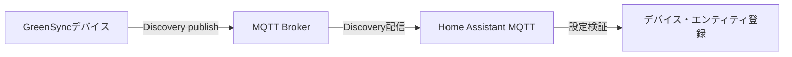

# MQTT Discovery 検証・デバッグ手順

## 1. 目的

GreenSyncデバイスがHome Assistantへ自動登録されない場合に、次の区間を順番に切り分ける。



## 2. 期待されるDiscoveryメッセージ

デバイス起動時、Brokerに次の4件がretain付きで存在すること。

| エンティティ | Discoveryトピック |
|---|---|
| Soil Moisture | `homeassistant/sensor/greensync_atom_s3_<hardware_id>/moisture/config` |
| Pump Active | `homeassistant/binary_sensor/greensync_atom_s3_<hardware_id>/watered/config` |
| WiFi RSSI | `homeassistant/sensor/greensync_atom_s3_<hardware_id>/rssi/config` |
| Watering Threshold | `homeassistant/number/greensync_atom_s3_<hardware_id>/watering_threshold/config` |

状態トピックは次の2件である。

- `greensync/atom-s3-<hardware_id>/state`
- `greensync/atom-s3-<hardware_id>/threshold/state`

`<hardware_id>` はAtom固有の12桁16進IDである。起動ログの `clientId` で実値を確認できる。

## 3. 検証手順

### Step 1: Home AssistantのMQTT接続を確認する

1. Home Assistantの「設定」→「デバイスとサービス」を開く。
2. MQTTインテグレーションが存在し、エラー表示がないことを確認する。
3. MQTTインテグレーションの「設定」を開き、Discoveryが有効であることを確認する。
4. Discovery prefixを変更している場合は確認する。ファームウェアは `homeassistant` を使用している。

MQTTインテグレーション自体が未接続の場合は、以降のデバイス検証より先にBrokerのホスト、ポート、認証情報を修正する。

### Step 2: Home AssistantでDiscoveryトピックを監視する

1. MQTTインテグレーションの「設定」または「構成」を開く。
2. 「トピックをリッスン」で `homeassistant/#` を指定する。
3. リッスンを開始する。
4. GreenSyncデバイスを再起動する。
5. 2章の4トピックを受信するか確認する。

retain付きメッセージがBrokerに保存済みなら、リッスン開始直後に表示される場合がある。

次に `greensync/#` をリッスンし、通常状態と閾値状態が届くことも確認する。

### Step 3: デバイスのシリアルログを確認する

デバイスをUSB接続し、ファームウェアディレクトリで次を実行する。

```bash
pio device monitor -b 115200
```

正常時は、概ね次のログになる。

```text
WiFi connected. IP=...
MQTT configuration: broker=...:1883, clientId=greensync-atom-s3-<hardware_id>, bufferBytes=1024
Connecting MQTT...connected
MQTT subscribe topic=greensync/atom-s3-<hardware_id>/threshold/set, result=OK
MQTT publish [discovery moisture] ... result=OK
MQTT publish [discovery pump] ... result=OK
MQTT publish [discovery rssi] ... result=OK
MQTT publish [discovery threshold] ... result=OK
MQTT publish [threshold state] ... result=OK
MQTT Discovery summary=ALL OK
```

判定方法:

| ログ | 判断 |
|---|---|
| MQTT接続が繰り返し失敗 | Broker接続先、ネットワーク、認証、ACLを確認する |
| `bufferBytes` が1024でない | 修正後のファームウェアが書き込まれていない可能性がある |
| いずれかのDiscoveryが `FAILED` | 接続切断、ACL、パケットサイズを確認する |
| 4件とも `OK` だがHAで見えない | Broker接続先の不一致、HAのDiscovery prefix、HA側設定検証エラーを確認する |

### Step 4: Broker上のメッセージを直接確認する

`mosquitto_sub` が使用できる端末から実行する。`BROKER_HOST` は実際のBrokerアドレスへ置き換える。

```bash
mosquitto_sub -h BROKER_HOST -p 1883 -v -t 'homeassistant/#'
```

認証を使用している場合:

```bash
mosquitto_sub -h BROKER_HOST -p 1883 -u MQTT_USER -P MQTT_PASSWORD -v -t 'homeassistant/#'
```

別ターミナルでデバイスを再起動し、4件のDiscoveryトピックとJSONが表示されることを確認する。

通常トピックも確認する。

```bash
mosquitto_sub -h BROKER_HOST -p 1883 -v -t 'greensync/#'
```

### Step 5: Discovery JSONを検証する

Brokerから取得した各payloadがJSONとして解釈できるかを確認する。例として、受信payloadをファイルへ保存した場合は次を使用できる。

```bash
jq . discovery-payload.json
```

JSONが壊れている場合は `jq` がエラーを返す。シリアルログの `payloadBytes` と、Brokerで受信したpayloadが途中で切れていないかも確認する。

### Step 6: Home AssistantのMQTTデバッグログを確認する

一時的にHome Assistantの `configuration.yaml` に次を設定する。

```yaml
logger:
  default: warning
  logs:
    homeassistant.components.mqtt: debug
```

Home Assistantを再起動してからGreenSyncデバイスを再起動し、Home Assistantログで次を確認する。

- `homeassistant/.../config` を受信しているか。
- Discovery payloadの検証エラーがないか。
- `unique_id` の重複がないか。
- MQTT Brokerとの切断・再接続が発生していないか。

検証終了後はログ量を抑えるため、上記debug設定を削除または通常レベルへ戻す。

## 4. 切り分け表

| デバイスログ | Brokerで購読 | HAで購読 | 推定箇所 |
|---|---|---|---|
| publish失敗 | 受信なし | 受信なし | デバイス、パケットサイズ、Broker ACL |
| publish成功 | 受信なし | 受信なし | デバイスと確認端末が異なるBrokerを参照している可能性 |
| publish成功 | 受信あり | 受信なし | Home AssistantのBroker設定、認証、Discovery prefix |
| publish成功 | 受信あり | 受信あり | Discovery JSON検証、重複ID、HAエンティティレジストリ |
| 4件登録、一部状態不明 | 状態あり | 状態あり | state topicまたはvalue template |

## 5. 今回追加した診断機能

- MQTT送受信用バッファを実行時に1024 bytesへ設定する。
- Broker、Client ID、バッファサイズを起動時に表示する。
- 閾値コマンドトピックのsubscribe結果を表示する。
- Discovery 4件を個別に成功判定する。
- 各publishについて、用途、トピック、payload長、バッファ長、接続状態、結果を表示する。
- Discovery全件の集約結果を `ALL OK` または `FAILED` で表示する。

## 6. 最初に共有してほしい診断結果

問題が継続する場合、次の情報があれば原因を絞り込める。パスワードは共有しないこと。

1. 起動から `MQTT Discovery summary` までのシリアルログ。
2. Home Assistantの `homeassistant/#` リッスン結果。
3. Home Assistant MQTTインテグレーションが接続済みか。
4. Home Assistantとデバイスが参照しているBrokerのIPアドレスとポートが一致するか。
5. Home Assistantログに表示されたMQTT Discovery関連エラー。
