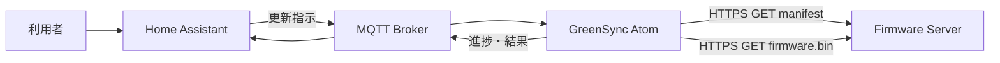
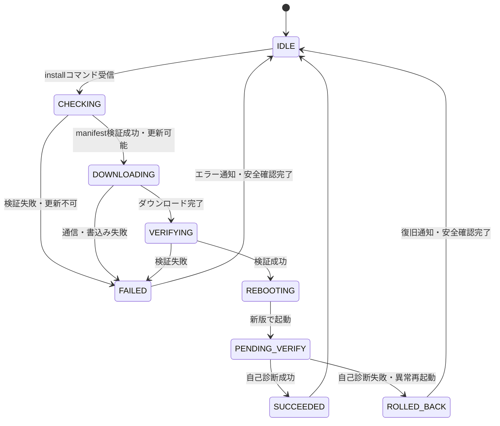
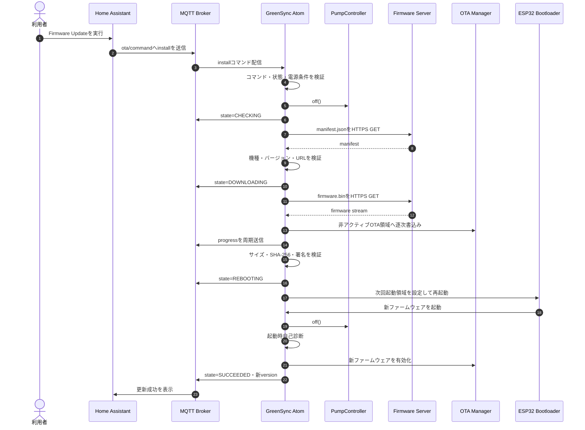
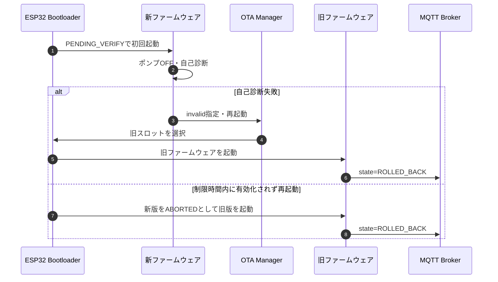
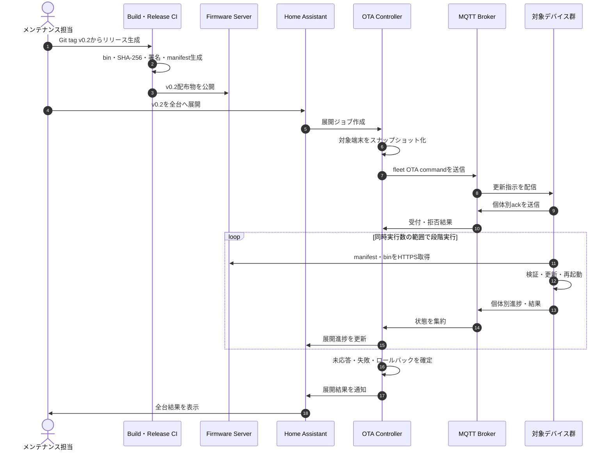

# GreenSync OTA機能仕様

## 1. 文書情報

| 項目 | 内容 |
|---|---|
| 対象 | GreenSync ATOMS3 Lite ファームウェア |
| 対象実装 | `firmware/atom-s3-lite` |
| 文書種別 | OTA機能仕様 |
| ステータス | Draft |
| 作成日 | 2026-07-20 |
| 関連Issue | [#18 Add OTA firmware update](https://github.com/toshiaki-sato9/greensync-poc/issues/18) |

## 2. 目的

設置済みのGreenSyncデバイスへ、USB接続を行わずWi-Fi経由でファームウェアを安全に配布する。Home Assistantから更新開始と進捗確認を行え、更新失敗時は直前の正常なファームウェアへ復旧できることを目標とする。

## 3. スコープ

### 3.1 対象範囲

- Wi-Fi経由のファームウェア更新
- Home Assistantからの更新指示
- HTTPSによるmanifestおよびファームウェア取得
- 更新可否判定、進捗、結果のMQTT通知
- ファームウェアの完全性・対象機種・バージョン検証
- 更新中のポンプ安全制御
- A/B OTAパーティションと起動後ヘルスチェック
- 更新失敗時のロールバック

### 3.2 対象外

- Wi-Fi認証情報やMQTT認証情報の遠隔変更
- ブートローダー、パーティションテーブル、NVSのOTA更新
- 複数デバイスへの一斉配信管理画面
- モバイル回線経由の更新
- ユーザーが任意に指定したURLからのファームウェア取得

## 4. 現状と前提

- 対象デバイスはM5Stack ATOMS3 Lite（ESP32-S3、Flash 8MB）である。
- ファームウェアはArduino frameworkとPlatformIOでビルドする。
- デバイスはWi-FiおよびMQTT Brokerへ接続する。
- Home Assistantは同一Brokerを利用する。
- OTA機能は現行ファームウェアには未実装である。
- OTA対応パーティションテーブル、更新用Webサーバー、証明書管理を新たに用意する必要がある。

## 5. 基本方式

OTAはHTTPS pull方式とする。Home AssistantはMQTTで更新を指示し、デバイス自身が事前に許可されたHTTPS配布元からmanifestとファームウェアを取得する。



### 5.1 採用理由

- Home AssistantやMQTT Brokerへ大容量バイナリを流さずに済む。
- HTTPS配布サーバー側でバージョンとファイルを一元管理できる。
- デバイス側で機種、サイズ、ハッシュ、署名を検証できる。
- Home Assistant停止中でも、開始済みダウンロードを継続できる。

## 6. OTA状態設計

| 状態 | 説明 | ポンプ |
|---|---|---|
| `IDLE` | OTA処理待機 | 通常制御 |
| `CHECKING` | manifest取得・更新可否判定 | OFF |
| `DOWNLOADING` | ファームウェア取得・書込み | OFF |
| `VERIFYING` | サイズ、ハッシュ、イメージ検証 | OFF |
| `REBOOTING` | 次回起動パーティション設定・再起動 | OFF |
| `PENDING_VERIFY` | 新ファームウェア初回起動・自己診断 | OFF |
| `SUCCEEDED` | 新ファームウェア検証完了 | 通常制御へ復帰 |
| `FAILED` | 更新処理失敗 | OFF後、明示的に通常制御へ復帰 |
| `ROLLED_BACK` | 新版の起動検証に失敗し旧版へ復旧 | 通常制御へ復帰前に状態確認 |



## 7. 更新開始条件

次の条件をすべて満たす場合のみ更新を開始する。

- Wi-FiおよびMQTT接続が確立している。
- 制御状態が `IDLE` であり、散水中ではない。
- Emergency Stop状態ではない。
- ポンプ出力をOFFにできる。
- 電源電圧またはバッテリー残量が更新可能基準を満たす。計測できない構成では、外部給電中のみ更新可能とする。
- manifestの対象ハードウェアが実機と一致する。
- 新バージョンが現在バージョンより新しい。強制更新は管理者用の明示操作に限定する。
- OTAパーティションにイメージを格納できる空き容量がある。
- 同時に別のOTA処理を実行していない。

条件不成立時は更新せず、理由をMQTT状態へ通知する。

## 8. ファームウェア配布仕様

### 8.1 配布ファイル

| ファイル | 内容 |
|---|---|
| `manifest.json` | バージョン、対象機種、バイナリURL、サイズ、ハッシュ、署名情報 |
| `firmware.bin` | PlatformIOが生成したアプリケーションイメージ |
| `firmware.bin.sig` | 製品化フェーズで使用する署名 |

### 8.2 Manifest例

```json
{
  "schemaVersion": 1,
  "version": "0.3.0",
  "hardware": "m5stack-atoms3-lite",
  "url": "https://firmware.example.com/greensync/0.3.0/firmware.bin",
  "size": 893029,
  "sha256": "0123456789abcdef0123456789abcdef0123456789abcdef0123456789abcdef",
  "signatureUrl": "https://firmware.example.com/greensync/0.3.0/firmware.bin.sig",
  "mandatory": false,
  "publishedAt": "2026-07-20T00:00:00Z"
}
```

### 8.3 配布サーバー要件

- HTTPSのみ許可し、HTTPへのダウングレードを禁止する。
- デバイスはサーバー証明書または信頼するCA証明書を検証する。
- リダイレクトは同一の許可済みオリジンに限定する。
- `Content-Length` を返す。
- manifestとバイナリはバージョンごとに不変とする。
- 配布済みファイルの上書きを禁止する。
- タイムアウト、再試行回数、最大サイズをデバイス側で制限する。

## 9. MQTTインターフェース

`<device_id>` は個体固有IDを表す。

### 9.1 トピック

| 方向 | トピック | retain | 用途 |
|---|---|---:|---|
| HA → Device | `greensync/<device_id>/ota/command` | No | 更新確認・開始コマンド |
| Device → HA | `greensync/<device_id>/ota/state` | Yes | OTA状態・進捗・結果 |
| Device → HA | `greensync/<device_id>/ota/version` | Yes | 実行中バージョン |

コマンドはQoS 1を推奨し、retainを禁止する。古いretainコマンドによる意図しない再更新を防ぐためである。

### 9.2 更新コマンド

```json
{
  "action": "install",
  "requestId": "018f6b90-7b61-7000-8000-000000000001",
  "manifestUrl": "https://firmware.example.com/greensync/stable/manifest.json",
  "targetVersion": "0.3.0",
  "requestedAt": "2026-07-20T00:00:00Z"
}
```

- `requestId` は要求ごとに一意とし、重複要求を排除する。
- `manifestUrl` は事前設定されたHTTPSオリジンとパスprefixに一致する場合のみ受理する。
- `targetVersion` とmanifestのバージョンが不一致の場合は拒否する。
- 許容する `action` は初期実装では `check` と `install` のみとする。

### 9.3 OTA状態

```json
{
  "requestId": "018f6b90-7b61-7000-8000-000000000001",
  "state": "DOWNLOADING",
  "currentVersion": "0.2.0",
  "targetVersion": "0.3.0",
  "progress": 42,
  "errorCode": null,
  "message": "Downloading firmware",
  "updatedAt": "2026-07-20T00:01:00Z"
}
```

`progress` は0～100とし、変化時または5秒周期のうち早い方で通知する。`errorCode` は成功時に `null` とする。

### 9.4 エラーコード

| コード | 内容 |
|---|---|
| `BUSY` | 散水中または別OTA実行中 |
| `EMERGENCY_STOP_ACTIVE` | 緊急停止中 |
| `POWER_NOT_SAFE` | 電源条件を満たさない |
| `INVALID_COMMAND` | コマンド形式不正 |
| `URL_NOT_ALLOWED` | 許可されていない配布元 |
| `MANIFEST_INVALID` | manifest形式・値不正 |
| `HARDWARE_MISMATCH` | 対象機種不一致 |
| `VERSION_NOT_ALLOWED` | バージョン条件不成立 |
| `TLS_ERROR` | HTTPS証明書・通信エラー |
| `DOWNLOAD_FAILED` | ダウンロード失敗 |
| `IMAGE_TOO_LARGE` | OTA領域超過 |
| `HASH_MISMATCH` | SHA-256不一致 |
| `SIGNATURE_INVALID` | 署名検証失敗 |
| `FLASH_WRITE_FAILED` | Flash書込み失敗 |
| `BOOT_VALIDATION_FAILED` | 新版の自己診断失敗 |
| `ROLLBACK_FAILED` | 旧版への復旧失敗 |

## 10. Home Assistant連携

### 10.1 エンティティ

MQTT Discoveryで次のエンティティを登録する。

| 種別 | 名前 | 用途 |
|---|---|---|
| sensor | Firmware Version | 現在のバージョン表示 |
| sensor | OTA Status | 状態、進捗、エラー表示 |
| update または button | Firmware Update | 更新確認・開始 |

初期PoCではbuttonによる手動開始を許容する。自動更新およびスケジュール更新は初期実装の対象外とする。

### 10.2 操作制約

- 更新開始前に確認ダイアログを表示する。
- 散水中、Emergency Stop中、オフライン時は更新操作を無効化または拒否する。
- 更新中は進捗と「ポンプ停止中」であることを表示する。
- 成功、失敗、ロールバックをHome Assistantの通知対象にできるようにする。

## 11. 内部シーケンス

### 11.1 正常更新



### 11.2 ロールバック



## 12. パーティション設計

OTA対応のカスタムパーティションテーブルを使用する。

| パーティション | 用途 |
|---|---|
| `nvs` | 永続設定 |
| `otadata` | 起動対象とOTA状態 |
| `ota_0` | アプリケーションスロットA |
| `ota_1` | アプリケーションスロットB |
| `spiffs` または同等領域 | 必要な場合のみ使用 |

- `ota_0` と `ota_1` は同一サイズとする。
- 各スロットは想定最大ファームウェアサイズを格納できること。
- 実装前に8MB Flash上の実サイズと境界をビルド成果物で検証する。
- パーティションテーブル自体はOTA更新対象にしない。
- ロールバック有効化には対応するBootloader設定が必要である。

## 13. 起動後ヘルスチェック

新版の初回起動では通常の自動散水を開始せず、ポンプをOFFにして次を確認する。

1. NVSを読込みできる。
2. Wi-Fiへ接続できる。
3. MQTT Brokerへ接続できる。
4. 個体固有の状態トピックをpublishできる。
5. 水分センサから妥当なADC値を取得できる。
6. ポンプGPIOがOFFである。
7. 致命的なリセットやWatchdog発生がない。

すべて成功した場合のみ新ファームウェアを有効化し、通常制御へ移行する。規定時間内に成功しない場合は新版を無効として再起動し、旧版へロールバックする。

ネットワーク障害だけで恒久的なロールバックループにならないよう、接続試行時間と「ファームウェア不良」「一時的な外部障害」の判定方針を実装設計時に定義する。

## 14. 安全要件

- OTA開始前にポンプをOFFにする。
- OTA処理中は自動散水および手動散水を禁止する。
- OTA処理中もBtnAの緊急停止入力を監視する。
- 新版初回起動の検証完了までポンプをONにしない。
- ダウンロードまたは検証失敗時に、未完成イメージを起動対象にしない。
- 電源断が発生しても、少なくとも一つの起動可能なイメージを維持する。
- MQTTのretain付き更新コマンドを受理しない。
- 同一 `requestId` の再実行を拒否する。

## 15. セキュリティ要件

### 15.1 PoC必須

- HTTPSとサーバー証明書検証
- 配布元URLのallowlist
- manifestに記載されたサイズとSHA-256の照合
- MQTT Brokerの認証とOTAトピックのACL
- ログへ認証情報、署名鍵、完全なトークンを出力しない
- ファームウェアバージョンの単調増加確認

### 15.2 製品化前に必須

- ファームウェアイメージのデジタル署名検証
- 署名用秘密鍵のCI/CD外部の安全な保管
- Secure Boot V2
- Flash Encryption
- セキュリティバージョンを用いたanti-rollback
- 証明書・署名鍵のローテーション手順

anti-rollbackは脆弱な旧版への復帰を禁止する機能であり、障害時に直前版へ戻す通常のロールバックとは目的が異なる。導入時は両方のポリシーを整合させる。

## 16. ログ・監視

デバイスはシリアルおよびMQTTへ次を記録する。

- request ID
- 現在・対象バージョン
- OTA状態遷移
- ダウンロード済みbytesと進捗率
- manifest、サイズ、ハッシュ、署名の検証結果
- 書込み先パーティション
- 再起動理由
- 新版の起動検証結果
- ロールバック結果
- エラーコード

秘密情報と署名検証用の機密データは記録しない。

## 17. テスト仕様

| 区分 | 試験 | 期待結果 |
|---|---|---|
| 正常 | 新バージョンを更新 | 新版で起動し `SUCCEEDED` を通知する |
| 同版 | 現在と同じバージョンを指定 | 更新せず `VERSION_NOT_ALLOWED` を通知する |
| 機種不一致 | 異なるhardwareのmanifest | `HARDWARE_MISMATCH` で拒否する |
| 改ざん | SHA-256が異なるbin | `HASH_MISMATCH` で起動対象にしない |
| TLS | 無効または期限切れ証明書 | `TLS_ERROR` で拒否する |
| URL | allowlist外URL | `URL_NOT_ALLOWED` で拒否する |
| サイズ | OTA領域より大きいbin | `IMAGE_TOO_LARGE` で拒否する |
| 通信断 | ダウンロード途中で切断 | 失敗通知し、現行版で動作を継続する |
| 電源断 | 書込み途中で電源断 | 現行の正常イメージから起動する |
| 散水中 | 散水中にinstall | `BUSY` で拒否し散水制御を維持する |
| 緊急停止 | Emergency Stop中にinstall | `EMERGENCY_STOP_ACTIVE` で拒否する |
| 初回起動失敗 | 新版が自己診断に失敗 | 旧版へロールバックする |
| Watchdog | 新版初回起動でWatchdog reset | 旧版へロールバックする |
| MQTT重複 | 同一request IDを再送 | 二重更新を開始しない |
| 複数台 | 2台へ個別指示 | 指定した個体だけ更新する |

## 18. フリートOTA・一括展開仕様

### 18.1 目的

ユーザーメンテナンスで公開した特定バージョンを、Home Assistantから全台または指定グループへ安全に展開できるようにする。一括展開では単なるMQTT broadcastではなく、展開ジョブ、対象端末、端末別結果を追跡する。

### 18.2 配信単位

| 単位 | 用途 | 例 |
|---|---|---|
| 個体 | 検証、障害端末の再実行 | `device_id` 指定 |
| グループ | 設置場所、用途、ハードウェア世代ごとの展開 | `debug`、`canary`、`outdoor-poc` |
| 全台 | 検証完了後の全体展開 | `all` |

デバイスは自分の個体トピックに加え、所属グループと全台トピックを購読する。グループ情報はキッティング時に設定し、MQTT状態として確認可能にする。

### 18.3 フリート用MQTTトピック

| 方向 | トピック | retain | 用途 |
|---|---|---:|---|
| Controller → Device | `greensync/fleet/all/ota/command` | No | 全台への更新指示 |
| Controller → Device | `greensync/fleet/<group_id>/ota/command` | No | グループへの更新指示 |
| Controller → Device | `greensync/<device_id>/ota/command` | No | 個体への更新・再試行指示 |
| Device → Controller | `greensync/<device_id>/ota/ack` | No | コマンド受付・拒否応答 |
| Device → Controller | `greensync/<device_id>/ota/state` | Yes | 進捗・最終結果 |
| Device → Controller | `greensync/<device_id>/ota/version` | Yes | 現在バージョン |
| Device → Controller | `greensync/<device_id>/inventory` | Yes | 個体・機種・グループ情報 |
| Controller → HA | `greensync/fleet/<deployment_id>/state` | Yes | 展開ジョブ集約状態 |

一括コマンドはretainを禁止する。オフライン端末には古いbroadcastを自動適用させず、復帰を検知したControllerが対象バージョンを再評価して個体トピックへ再指示する。

### 18.4 展開ジョブ

全台またはグループ展開ごとに `deploymentId` を発行する。展開開始時点の対象端末をスナップショットとして保存し、途中で追加された端末を同じジョブへ暗黙に含めない。

```json
{
  "action": "install",
  "deploymentId": "deploy-20260720-v020",
  "requestId": "deploy-20260720-v020-broadcast-1",
  "targetVersion": "0.2.0",
  "manifestUrl": "https://firmware.example.com/greensync/v0.2.0/manifest.json",
  "strategy": "canary",
  "maxConcurrency": 5,
  "randomDelaySeconds": 300,
  "expiresAt": "2026-07-21T00:00:00Z"
}
```

| フィールド | 必須 | 説明 |
|---|---:|---|
| `deploymentId` | Yes | 全端末で共通の展開識別子 |
| `requestId` | Yes | MQTTコマンド単位の一意識別子 |
| `targetVersion` | Yes | 展開対象バージョン |
| `manifestUrl` | Yes | 許可済み配布元のmanifest |
| `strategy` | Yes | `individual`、`canary`、`group`、`all` |
| `maxConcurrency` | No | Controllerが同時更新を許可する最大台数 |
| `randomDelaySeconds` | No | broadcast受信後の負荷分散待機時間上限 |
| `expiresAt` | Yes | コマンド有効期限 |

各端末は `deploymentId` と自分の `device_id` から決定的な待機時間を算出し、同時ダウンロードを避ける。期限切れコマンドは実行しない。

### 18.5 端末インベントリ

一括展開前に、Controllerは少なくとも次の端末情報を保持する。

```json
{
  "deviceId": "greensync-atom-s3-a1b2c3d4e5f6",
  "hardware": "m5stack-atoms3-lite",
  "firmwareVersion": "0.1.0",
  "groups": ["outdoor-poc"],
  "online": true,
  "otaCapable": true,
  "lastSeenAt": "2026-07-20T00:00:00Z"
}
```

インベントリに存在しない端末、機種不一致端末、OTA未対応端末は展開対象から除外し、除外理由を結果へ残す。

### 18.6 展開ジョブ状態

| 状態 | 説明 |
|---|---|
| `DRAFT` | 対象・バージョン確認中 |
| `SCHEDULED` | 開始待ち |
| `RUNNING` | 展開中 |
| `PAUSED` | 管理者または自動判定により一時停止 |
| `CANCELLING` | 未開始端末への中止処理中 |
| `SUCCEEDED` | 全対象端末が成功または許容済み除外 |
| `PARTIALLY_SUCCEEDED` | 成功と失敗・未応答が混在 |
| `FAILED` | 成功率が基準未満、または重大障害発生 |
| `CANCELLED` | 展開中止完了 |

集約状態には対象総数、受付、更新中、成功、失敗、ロールバック、オフライン、除外の件数を含める。

```json
{
  "deploymentId": "deploy-20260720-v020",
  "state": "RUNNING",
  "targetVersion": "0.2.0",
  "total": 20,
  "accepted": 18,
  "inProgress": 4,
  "succeeded": 10,
  "failed": 1,
  "rolledBack": 1,
  "offline": 2,
  "excluded": 0
}
```

### 18.7 展開手順

全台展開は次の順序で行う。

1. GitタグからCI/CDで再現可能なビルドを生成する。
2. bin、SHA-256、署名、manifestを同一リリースとしてHTTPSサーバーへ公開する。
3. 公開後の配布物を再ダウンロードしてハッシュと署名を検証する。
4. Home Assistantで対象バージョン、対象台数、除外端末を確認する。
5. デバッグ端末1台へ更新する。
6. Canaryグループへ展開する。
7. 成功率と観測時間の基準を満たした後、対象を段階的に拡大する。
8. 全対象端末の成功、失敗、オフライン、ロールバック結果を確定する。
9. 未更新端末を個体別に再試行または保守対象として記録する。

### 18.8 一括展開シーケンス



### 18.9 段階展開・自動停止

初期値として次の段階を推奨する。

| 段階 | 対象 | 次段階への条件 |
|---|---|---|
| 1 | デバッグ端末1台 | 更新・再起動・散水安全確認が成功 |
| 2 | Canaryグループ | 観測時間内に重大障害なし |
| 3 | 全体の10～20% | 成功率が設定基準以上 |
| 4 | 残り | 管理者承認または自動承認 |

次の場合、Controllerは新規端末への指示を自動停止し、ジョブを `PAUSED` にする。

- ロールバックが1台以上発生した。
- 更新失敗率が設定閾値を超えた。
- 更新後にポンプ、センサ、Watchdogの重大異常を検出した。
- Firmware ServerまたはBrokerで継続的な障害を検出した。

既にFlash書込み中の端末を強制停止してはならない。キャンセルは未開始または安全に中断可能な状態の端末だけに適用する。

### 18.10 オフライン・再試行

- オフライン端末は `OFFLINE_PENDING` として記録する。
- broadcastコマンドをretainして後日実行させてはならない。
- 端末復帰時、Controllerは現在バージョンと対象スナップショットを照合する。
- コマンド有効期限内であれば、個体トピックへ新しい `requestId` で再送する。
- 有効期限後は自動更新せず、管理者の再承認を要求する。
- 通信エラーの再試行は指数バックオフと最大回数を設定する。
- 機種不一致、ハッシュ不一致、署名不正は自動再試行しない。

### 18.11 バージョン・配布物管理

Gitタグ名、ファームウェア内バージョン、manifestの `version` を一致させる。`v0.2` タグの場合、セマンティックバージョンの正規値は `0.2.0` として扱う。

リリースごとに次を保存する。

- Git commit SHA
- Git tag
- ビルド環境と依存バージョン
- `firmware.bin`
- ファイルサイズ
- SHA-256
- 署名
- manifest
- 公開日時と公開者

手作業で生成元不明のbinをアップロードしてはならない。CI/CDがGitタグから生成した成果物を正本とし、公開後のファイルを上書きしない。

同一バージョンの再インストールまたは旧版へのダウングレードは、通常の全台展開では拒否する。障害復旧で必要な場合は、対象個体、理由、有効期限を指定した管理者承認済みコマンドに限定する。anti-rollback有効化後はセキュリティバージョンに反する旧版を使用できない。

### 18.12 Home AssistantとOTA Controllerの責務

#### PoC

小規模PoCではHome Assistant AutomationがControllerの役割を兼ねてもよい。ただし次を永続化する。

- `deploymentId`
- 対象端末スナップショット
- 端末別の現在・対象バージョン
- ack、進捗、最終結果
- 再試行回数と最終エラー

#### 運用段階

台数増加後は専用OTA Controllerがインベントリ、同時実行数、段階展開、再試行、監査ログを管理する。Home Assistantは展開開始、承認、停止、進捗表示、通知のUIとして利用する。

### 18.13 フリートOTA試験

| 試験 | 期待結果 |
|---|---|
| 全台展開 | 対象スナップショット内の全オンライン端末が更新される |
| グループ展開 | 指定グループだけが更新される |
| 個体除外 | 除外端末はコマンドを実行しない |
| 同時接続制限 | 設定した同時実行数を超えない |
| 負荷分散 | 端末がランダム待機し、同時ダウンロードが集中しない |
| オフライン復帰 | 期限内に個体別コマンドで再試行される |
| 期限切れ | 復帰端末が古い展開を自動実行しない |
| Canary失敗 | 後続段階が開始されず `PAUSED` になる |
| ロールバック発生 | 新規展開を停止し、対象端末と原因を通知する |
| 重複コマンド | 同じ展開を二重実行しない |
| Broker再接続 | retainされていない古いinstallを再実行しない |
| サーバー高負荷 | バックオフし、既存制御と起動可能イメージを維持する |
| 結果集約 | 成功、失敗、未応答、除外の合計が対象総数と一致する |

## 19. 実装フェーズ

### Phase 1: PoC実装

- OTAパーティションテーブル
- HTTPS manifest・binダウンロード
- SHA-256、サイズ、機種、バージョン検証
- MQTTコマンド・状態通知
- Home Assistantの手動更新操作
- Home Assistant Automationによる個体・グループ・全台展開
- 展開ID、対象スナップショット、端末別結果の記録
- デバッグ端末から始める段階展開
- 更新中のポンプ停止・散水禁止
- 起動後ヘルスチェックとロールバック検証
- シリアル復旧手順

### Phase 2: 運用強化

- CI/CDからのmanifest・bin配布
- 専用OTA Controllerによるインベントリ・展開ジョブ管理
- Canary、自動停止、同時実行数を含む段階配信
- リトライ・帯域・更新時間帯制御
- Home Assistant通知・監視ダッシュボード
- 更新履歴と監査ログ

### Phase 3: 製品化セキュリティ

- イメージ署名
- Secure Boot、Flash Encryption
- anti-rollback
- 鍵・証明書ローテーション

## 20. 完了条件

- Home Assistantから対象デバイスのOTA更新を開始できる。
- HTTPSで取得したイメージのサイズとSHA-256を検証できる。
- 更新中と新版初回起動中にポンプが作動しない。
- 更新成功後、バージョンと成功状態をHome Assistantで確認できる。
- ダウンロード失敗・電源断・起動検証失敗の各試験で起動可能な旧版を維持できる。
- 複数デバイス環境で対象個体だけが更新される。
- 全台・グループ展開で、対象端末ごとの受付、成功、失敗、ロールバック、未応答を集約できる。
- Canary失敗やロールバック発生時に後続展開を停止できる。
- オフライン端末が古いretainコマンドを意図せず実行しない。
- USB経由で復旧できる手順が文書化されている。

## 21. 未決事項

- Firmware Serverの実装・配置先
- manifest URLを固定設定にするか、許可済み範囲でMQTT指定可能にするか
- バッテリー残量または外部給電の検出方法
- 初回起動ヘルスチェックの制限時間
- Arduino frameworkのままBootloader rollbackを構成する方法、またはESP-IDFへの移行要否
- Home AssistantでMQTT update entityを採用するか、buttonとsensorで開始するか
- 署名方式と公開鍵の格納方法
- PoCにおけるHome Assistantの展開ジョブ永続化方式
- 専用OTA Controllerへ移行する台数・運用条件
- Canary観測時間、成功率、失敗率の具体的な判定値
- グループ情報の設定・変更・監査方法

## 22. 参考資料

- [Espressif ESP32-S3 OTA API / App rollback](https://docs.espressif.com/projects/esp-idf/en/stable/esp32s3/api-reference/system/ota.html)
- [Espressif ESP32-S3 Security Overview](https://docs.espressif.com/projects/esp-idf/en/latest/esp32s3/security/security.html)
