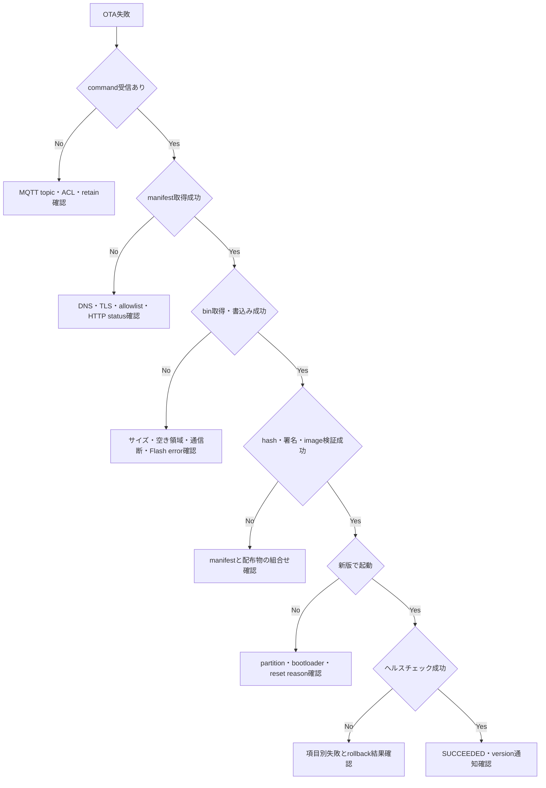

# OTA Phase 1 検証計画・PASS判定基準

## 1. 目的

OTA Phase 1の実装が、単にファームウェアを書き換えられるだけでなく、通信障害、改ざん、電源断、起動失敗時にもポンプとデバイスを安全な状態に維持できることを確認する。

本書は次の2段階で使用する。

- 基盤検証: 現在実装済みのバージョン通知とA/Bパーティションを確認する。
- Phase 1受入検証: HTTPS OTA、検証、ポンプ安全制御、ロールバック実装後にPhase 1全体のPASSを判定する。

## 2. PASS判定ルール

### 2.1 優先度

| 優先度 | 意味 | Phase 1 PASS条件 |
|---|---|---|
| P0 | 安全性、起動可能性、改ざん防止に直結 | 全件PASS必須 |
| P1 | 基本機能、運用・診断に必要 | 全件PASS必須 |
| P2 | 長時間安定性、補助的な運用品質 | 未完了の場合はIssueと期限が必要 |

### 2.2 総合判定

次の条件をすべて満たした場合のみ、OTA Phase 1を `PASS` とする。

- P0が全件PASSである。
- P1が全件PASSである。
- 未解決のCriticalまたはHigh severity不具合がない。
- 失敗したテストを修正後に再実行し、再現しないことを確認している。
- 使用したbin、manifest、Git commit、実機ID、ログを追跡できる。
- USBシリアルで現行版へ復旧できることを確認している。
- 24時間の通常動作で意図しない再起動、ポンプ作動、MQTT切断ループがない。

`BLOCKED`、`NOT RUN`、証跡なしはPASSとして扱わない。

## 3. 現在の実装状況

| 機能 | 状態 | 対応する検証 |
|---|---|---|
| ビルド時バージョン埋め込み | 実装済み | BLD-003、DEV-002、MQT-001 |
| Firmware Version Discovery | 実装済み | MQT-002、HA-001 |
| 8MB A/B OTAパーティション | 実装済み | BLD-001、BLD-002、DEV-001 |
| OTA Manager状態制御 | 未実装 | OTA-001以降 |
| HTTPS manifest・bin取得 | 未実装 | NET-001以降 |
| SHA-256・イメージ検証 | 未実装 | SEC-001以降 |
| 起動後ヘルスチェック | 未実装 | BOOT-001以降 |
| 自動ロールバック | 未実装 | RBK-001以降 |

基盤検証だけではPhase 1全体のPASSとは判定しない。

## 4. 検証環境

### 4.1 必要機材・サービス

- M5Stack ATOMS3 Lite
- M5Stack Unit Watering
- ポンプまたはポンプ出力確認用LED・テスター
- 安定したUSB電源
- テスト用Wi-Fi
- テスト用MQTT Broker
- Home Assistant MQTTインテグレーション
- HTTPS Firmware Server
- 正常版とテスト用異常版のファームウェア
- シリアルログを取得できるPC

水を接続した実ポンプで異常系試験を行わない。最初はLEDまたはテスターでGPIO出力を確認し、安全性を確認した後に実ポンプで最終確認する。

### 4.2 記録する識別情報

| 項目 | 記録例 |
|---|---|
| 試験実施日時 | ISO 8601 |
| Git commit SHA | `5dbbe33...` |
| ビルドバージョン | `0.3.0-dev` |
| device ID | シリアルログのClient ID |
| MAC・hardware ID | 12桁個体ID |
| 旧バージョン | `0.2.0` |
| 更新対象バージョン | テスト用バージョン |
| firmware.bin SHA-256 | 64桁16進値 |
| manifest URL | 秘密情報を含まないURL |
| MQTT Broker | ホスト名とポート。パスワードは記録しない |

## 5. 事前準備

### 5.1 ビルド

```bash
cd firmware/atom-s3-lite
pio run
```

### 5.2 書込み・シリアル監視

リポジトリルートで実行する。

```bash
bash build.sh
```

または個別に実行する。

```bash
pio run -t upload --upload-port /dev/cu.usbmodemXXXX
pio device monitor --port /dev/cu.usbmodemXXXX --baud 115200
```

### 5.3 MQTT監視

```bash
mosquitto_sub -h BROKER_HOST -p 1883 -v \
  -t 'homeassistant/#' \
  -t 'greensync/#'
```

認証がある場合はユーザー名とパスワードをコマンド履歴へ残さない方法を使用する。

## 6. 基盤検証

### BLD-001: パーティションテーブル生成

| 項目 | 内容 |
|---|---|
| 優先度 | P0 |
| 手順 | `pio run` を実行し、`partitions.bin` が生成されることを確認する |
| 期待結果 | ビルドが成功し、partition overlapまたはFlash容量超過がない |
| 証跡 | PlatformIOビルドログ |

PASS基準:

- `nvs`、`otadata`、`ota_0`、`ota_1` が存在する。
- `ota_0` と `ota_1` がそれぞれ3MiBで同一サイズである。
- 全パーティション終端が8MiB以内である。

### BLD-002: ファームウェアサイズ

| 項目 | 内容 |
|---|---|
| 優先度 | P0 |
| 手順 | PlatformIOのFlash使用量を確認する |
| 期待結果 | firmware.binが1スロットのサイズ以内である |
| 証跡 | サイズ表示とfirmware.binの実サイズ |

PASS基準は、現在のbinサイズに将来増加分20%以上を加えてもOTAスロットへ格納できることとする。

### BLD-003: バージョン埋め込み

| 項目 | 内容 |
|---|---|
| 優先度 | P1 |
| 手順 | `GREENSYNC_FIRMWARE_VERSION` を指定してビルドする |
| 期待結果 | 指定した値が起動ログとMQTTへ同一文字列で表示される |
| 証跡 | `platformio.ini`、起動ログ、MQTT payload |

### DEV-001: 実機のパーティション認識

| 項目 | 内容 |
|---|---|
| 優先度 | P0 |
| 手順 | USBで書き込み、起動時に実行中・次回更新先パーティションを診断出力する |
| 期待結果 | 実行中appと非アクティブOTAスロットを識別できる |
| 証跡 | シリアルログ |

実行中パーティション診断が未実装の間は本項目をPASSにしない。

### DEV-002: 起動ログのバージョン

| 項目 | 内容 |
|---|---|
| 優先度 | P1 |
| 手順 | デバイスを再起動し、起動バナーを確認する |
| 期待結果 | `GreenSync Firmware v0.3.0-dev` が表示される |
| 証跡 | シリアルログ |

### MQT-001: バージョン状態通知

| 項目 | 内容 |
|---|---|
| 優先度 | P1 |
| 手順 | `greensync/#` をListenしてデバイスを再起動する |
| 期待結果 | 個体別 `ota/version` にversionとhardwareを含むJSONがretain付きで届く |
| 証跡 | MQTT受信ログ |

期待payload例:

```json
{
  "version": "0.3.0-dev",
  "hardware": "m5stack-atoms3-lite"
}
```

### MQT-002: Firmware Version Discovery

| 項目 | 内容 |
|---|---|
| 優先度 | P1 |
| 手順 | `homeassistant/#` をListenしてデバイスを再起動する |
| 期待結果 | 個体ID付き `firmware_version/config` を受信する |
| 証跡 | MQTT受信ログ |

### HA-001: Home Assistant表示

| 項目 | 内容 |
|---|---|
| 優先度 | P1 |
| 手順 | Home Assistantのデバイス画面を確認する |
| 期待結果 | Firmware Version診断センサーが自動登録され、MQTT値と一致する |
| 証跡 | エンティティ画面のスクリーンショット |

## 7. OTA正常系検証

### OTA-001: 更新コマンド受付

| 項目 | 内容 |
|---|---|
| 優先度 | P1 |
| 手順 | 有効な `install` コマンドを個体トピックへretainなしで送信する |
| 期待結果 | request ID付きackを返し、`IDLE` から `CHECKING` へ遷移する |
| 証跡 | command、ack、stateのMQTTログ |

### OTA-002: 正常更新

| 項目 | 内容 |
|---|---|
| 優先度 | P0 |
| 手順 | 旧版から新しい正常版へHTTPS OTAする |
| 期待結果 | `CHECKING` → `DOWNLOADING` → `VERIFYING` → `REBOOTING` → `PENDING_VERIFY` → `SUCCEEDED` の順に遷移する |
| 証跡 | MQTT状態ログ、シリアルログ、更新前後バージョン |

PASS基準:

- 更新後バージョンがmanifestと一致する。
- device IDとNVSの散水閾値が更新前後で維持される。
- Home Assistantが同じデバイスとして認識する。
- 更新処理が二重に開始されない。

### OTA-003: 進捗通知

| 項目 | 内容 |
|---|---|
| 優先度 | P1 |
| 手順 | firmware.bin取得中の `ota/state` を記録する |
| 期待結果 | progressが0～100の範囲で後戻りせず、変化時または5秒以内に更新される |
| 証跡 | 時刻付きMQTTログ |

### OTA-004: 同一request ID

| 項目 | 内容 |
|---|---|
| 優先度 | P0 |
| 手順 | 同じrequest IDを複数回送信する |
| 期待結果 | OTAは1回だけ実行され、重複要求を拒否または既存状態で応答する |
| 証跡 | MQTTログと再起動回数 |

### OTA-005: retainコマンド安全性

| 項目 | 内容 |
|---|---|
| 優先度 | P0 |
| 手順 | retain付きinstallをBrokerに置き、デバイスを再接続・再起動する |
| 期待結果 | 意図しないOTAを開始しない |
| 証跡 | Brokerとデバイスログ |

試験終了後はretainコマンドを必ず消去する。

## 8. Manifest・セキュリティ検証

| ID | 優先度 | 試験 | 期待結果 |
|---|---|---|---|
| MAN-001 | P1 | 正常manifest | 検証後にダウンロードを開始する |
| MAN-002 | P0 | JSON不正・必須項目欠落 | `MANIFEST_INVALID`、Flash書込みなし |
| MAN-003 | P0 | hardware不一致 | `HARDWARE_MISMATCH`、ダウンロードなし |
| MAN-004 | P1 | 同一・旧バージョン | `VERSION_NOT_ALLOWED` |
| MAN-005 | P0 | OTA領域を超えるsize | `IMAGE_TOO_LARGE`、ダウンロードなし |
| NET-001 | P0 | HTTP URL | HTTPS以外を拒否する |
| NET-002 | P0 | allowlist外HTTPS URL | `URL_NOT_ALLOWED` |
| NET-003 | P0 | 無効・期限切れ証明書 | `TLS_ERROR` |
| NET-004 | P0 | 許可外オリジンへのredirect | redirectを拒否する |
| SEC-001 | P0 | binの1byteを改ざん | `HASH_MISMATCH`、起動対象にしない |
| SEC-002 | P0 | ESP32イメージでないファイル | イメージ検証失敗、起動対象にしない |
| SEC-003 | P0 | 無効署名 | `SIGNATURE_INVALID`、起動対象にしない |
| SEC-004 | P1 | ログ確認 | Wi-Fi、MQTT、HTTPSの秘密情報が出力されない |

各異常試験後、現行ファームウェアが再起動後も正常動作することを確認する。

## 9. 通信・電源障害検証

| ID | 優先度 | 試験 | 期待結果 |
|---|---|---|---|
| FLT-001 | P0 | manifest取得中にWi-Fi切断 | 失敗通知し、現行版を維持する |
| FLT-002 | P0 | bin取得25%でWi-Fi切断 | 未完成イメージを起動せず、現行版を維持する |
| FLT-003 | P0 | bin取得75%でサーバー停止 | 未完成イメージを起動せず、現行版を維持する |
| FLT-004 | P1 | OTA中にMQTT切断 | OTA安全処理を継続し、再接続後に最終状態を通知する |
| FLT-005 | P0 | Flash書込み中に電源断 | 再給電後、旧正常版から起動する |
| FLT-006 | P0 | 次回起動設定直前・直後に電源断 | いずれかの有効なイメージから起動する |
| FLT-007 | P1 | 低速・断続回線 | タイムアウトと再試行上限を守り、Watchdog resetしない |

電源断試験は同じタイミングだけでなく、進捗25%、50%、90%付近でそれぞれ実施する。

## 10. ポンプ・安全制御検証

| ID | 優先度 | 試験 | 期待結果 |
|---|---|---|---|
| SAF-001 | P0 | IDLEからOTA開始 | 開始前にポンプがOFFになる |
| SAF-002 | P0 | WATERING中にinstall | `BUSY` で拒否し、OTAを開始しない |
| SAF-003 | P0 | Emergency Stop中にinstall | `EMERGENCY_STOP_ACTIVE` で拒否する |
| SAF-004 | P0 | OTA中に水分率が閾値未満 | 自動散水を開始しない |
| SAF-005 | P0 | OTA中に手動散水要求 | ポンプをONにしない |
| SAF-006 | P0 | OTA中にBtnA長押し | 緊急停止を受理し、ポンプOFFを維持する |
| SAF-007 | P0 | 新版初回起動・検証中 | `SUCCEEDED` までポンプOFFを維持する |
| SAF-008 | P0 | OTA失敗・ロールバック | 再起動中と復旧確認中にポンプOFFを維持する |

PASS判定はシリアルログだけでなく、GPIOまたはポンプ電源の実測を証跡とする。

## 11. 起動検証・ロールバック

| ID | 優先度 | 試験 | 期待結果 |
|---|---|---|---|
| BOOT-001 | P0 | 正常な新版を初回起動 | `PENDING_VERIFY` を経て有効化する |
| BOOT-002 | P0 | NVS読込みを故意に失敗 | 新版を無効化して旧版へ戻る |
| BOOT-003 | P0 | センサ自己診断を故意に失敗 | 新版を無効化して旧版へ戻る |
| BOOT-004 | P0 | 新版初回起動で異常終了 | 次回起動で旧版へ戻る |
| BOOT-005 | P0 | 新版初回起動でWatchdog reset | 次回起動で旧版へ戻る |
| BOOT-006 | P1 | Wi-FiまたはBroker一時停止 | 外部障害だけで恒久ロールバックループにならない |
| RBK-001 | P0 | 明示的ロールバック | 旧版が起動し `ROLLED_BACK` を通知する |
| RBK-002 | P0 | ロールバック後の設定確認 | device ID、閾値、Discoveryが維持される |
| RBK-003 | P1 | ロールバック理由 | 原因、新旧version、再起動理由を確認できる |

## 12. Home Assistant受入検証

| ID | 優先度 | 試験 | 期待結果 |
|---|---|---|---|
| HA-002 | P1 | OTA Status Discovery | 状態・進捗・エラーを表示する |
| HA-003 | P1 | Firmware Update操作 | 対象個体へretainなしコマンドを送信する |
| HA-004 | P1 | 正常更新 | 更新後versionと成功を表示する |
| HA-005 | P1 | 更新拒否 | BUSY等の拒否理由を表示する |
| HA-006 | P1 | 更新失敗 | エラーコードと最終稼働versionを表示する |
| HA-007 | P1 | ロールバック | ロールバック発生と復旧versionを表示する |
| HA-008 | P0 | 複数台 | 操作した個体だけが更新される |

## 13. 回帰・安定性検証

| ID | 優先度 | 試験 | 期待結果 |
|---|---|---|---|
| REG-001 | P1 | 水分計測 | 10秒周期の計測・MQTT通知が継続する |
| REG-002 | P1 | 通常の自動散水 | OTA待機中は従来仕様どおり動作する |
| REG-003 | P0 | Emergency Stop | 散水中・待機中にポンプを停止できる |
| REG-004 | P1 | 閾値変更 | Home Assistantから変更し、再起動後も維持する |
| REG-005 | P1 | MQTT再接続 | Discovery、version、stateを再送する |
| STB-001 | P2 | 24時間連続動作 | 意図しない再起動、メモリ枯渇、ポンプ作動がない |
| STB-002 | P2 | OTA連続10回 | 10回すべて成功し、NVSと個体IDを維持する |
| STB-003 | P2 | 成功・失敗混在10回 | 起動不能にならず、結果が各回で一致する |

## 14. デバッグ観点

### 14.1 必須ログ

- firmware version、hardware、device ID
- 実行中・次回更新先パーティション
- request ID
- OTA状態遷移
- manifest URLのホストとパス。認証情報は除去する
- HTTP status、Content-Length、受信bytes
- SHA-256・署名・イメージ検証結果
- ESP-IDF・Arduino OTA APIのエラーコード
- ポンプ制御禁止・解除理由
- 再起動理由
- 起動後ヘルスチェック項目別結果
- ロールバック元・先versionと理由

### 14.2 切り分け順序



## 15. テスト結果記録テンプレート

```markdown
### <Test ID>: <Test name>

- Result: PASS / FAIL / BLOCKED / NOT RUN
- Date:
- Tester:
- Device ID:
- Git commit:
- From version:
- To version:
- firmware SHA-256:
- Request ID:
- Expected:
- Actual:
- Evidence:
- Issue:
- Retest result:
```

## 16. Phase 1リリース判定チェックリスト

- [ ] BLD・DEVのP0/P1が全件PASS
- [ ] MQTT・Home AssistantのP0/P1が全件PASS
- [ ] OTA正常系のP0/P1が全件PASS
- [ ] Manifest・HTTPS・完全性検証のP0/P1が全件PASS
- [ ] 通信断・電源断試験のP0/P1が全件PASS
- [ ] ポンプ安全試験のP0が全件PASS
- [ ] 起動検証・ロールバックのP0/P1が全件PASS
- [ ] 既存機能の回帰試験がPASS
- [ ] 24時間安定性試験がPASS、または未完了理由とIssueがある
- [ ] USBシリアル復旧を実機で確認済み
- [ ] Critical・High severityの未解決不具合なし
- [ ] テスト証跡が端末・commit・binへ紐付いている
- [ ] レビュー担当者がPASS判定を承認済み
